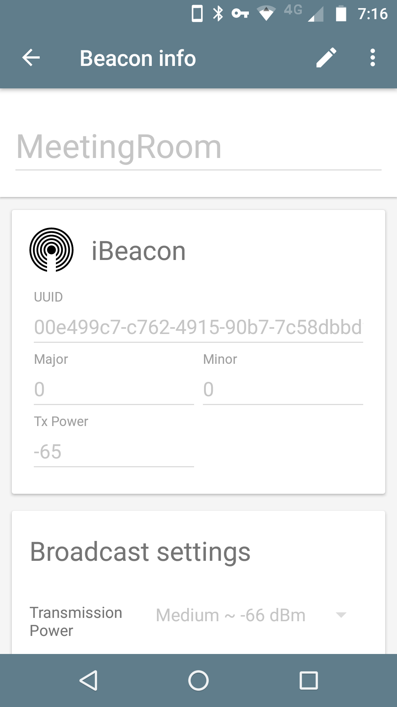
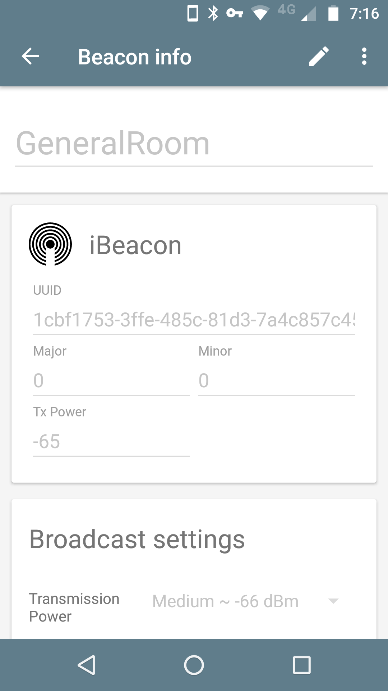
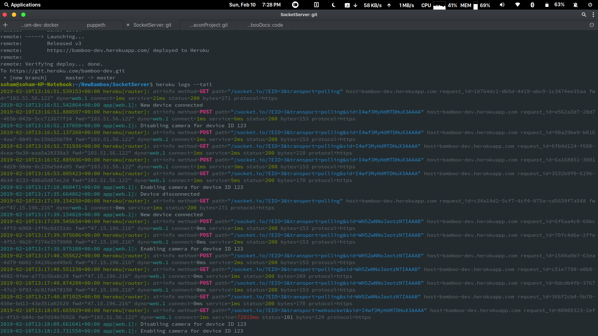
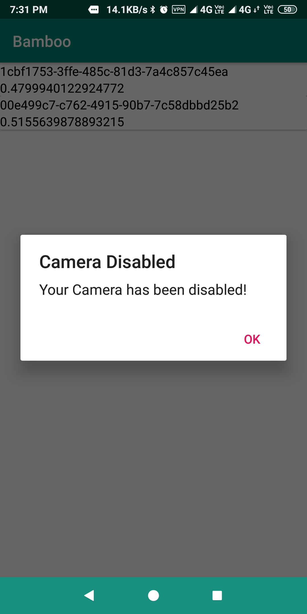
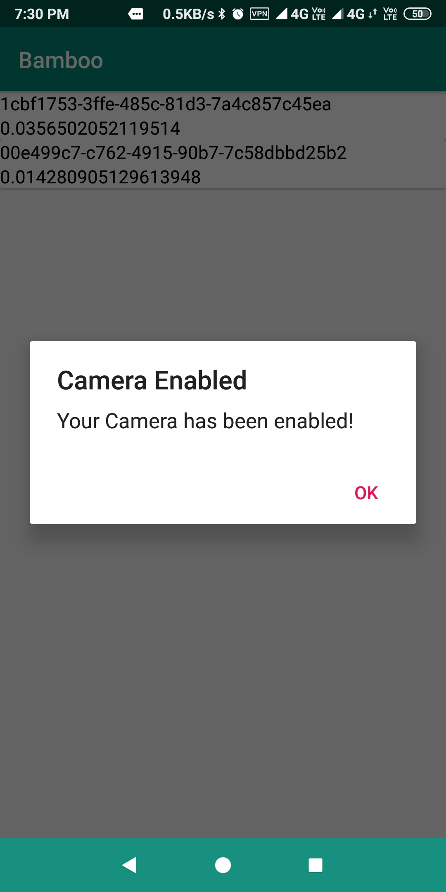

# Bamboo Demo

The demo will show camera being enabled & disabled, along with server communication. Two Android devices will be needed.

### On 1st device

1. Install the Beacon simulator app from the Google Play store (on your 1st device): [Beacon Simulator](https://play.google.com/store/apps/details?id=net.alea.beaconsimulator)
2. Open the app & create a new iBeacon type beacon with beacon ID `00e499c7-c762-4915-90b7-7c58dbbd25b2`. You can label this beacon `MeetingRoom`.

3. Create another iBeacon type beacon with beacon ID `1cbf1753-3ffe-485c-81d3-7a4c857c45ea`. You can label this beacon `GeneralRoom`.

4. Toggle on/off broadcast for `MeetingRoom` & `GeneralRoom` as necessary.

### On 2nd device

1. Install the Bamboo app (on your 2nd device): [Bamboo.apk](./Bamboo.apk)
2. Grant permissions as required for Bluetooth, Location & Device Admin.
3. When 2nd device is in proximity of `MeetingRoom`, camera will be disabled.
4. When 2nd device is in proximity of `GeneralRoom`, camera will be enabled.

